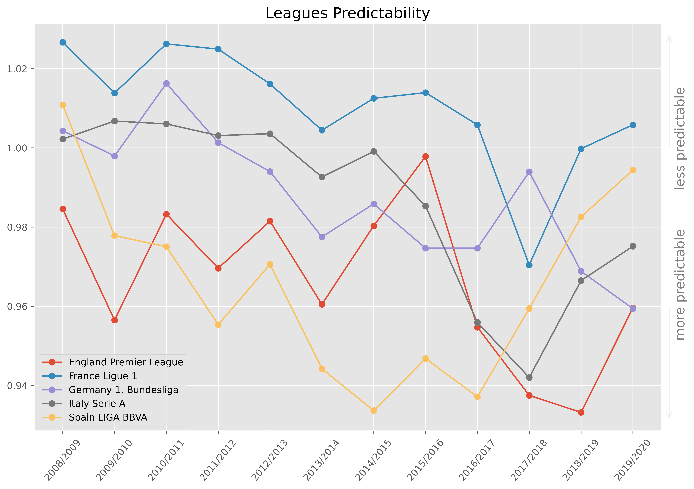
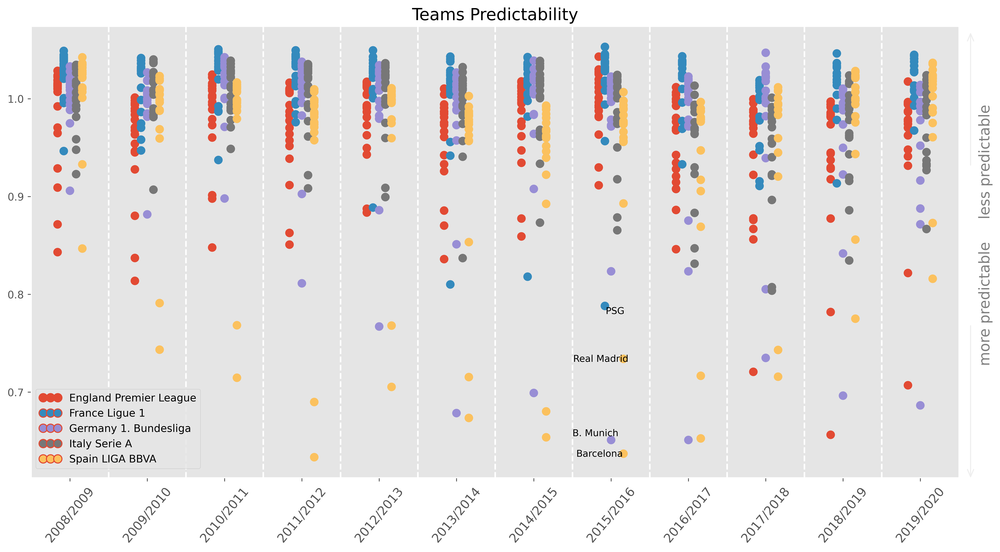

The Most Predictable League
==============================

This work tries to answer the next question: *How predictable football really is?*

I found this post: https://labtwentyone.tumblr.com/post/147894684062/why-did-we-stop-loving-football  
and I'm just updating the data and restructuring the project.

Quick explanation in docs: https://jartigag.xyz/football-entropy/

## Results

---
(forked from [https://github.com/yonilev/football-entropy](https://github.com/yonilev/football-entropy))

Project Organization
------------

    ├── Makefile           <- Commands like `make create_environment` or `make make_data`
    ├── README.md          <- The top-level README for developers using this project.
    ├── data
    │   ├── processed      <- The final, canonical data sets for modeling.
    │   └── raw            <- The original, immutable data dump.
    │
    ├── docs               <- A default MkDocs project; see mkdocs.org for details
    │
    ├── notebooks          <- Jupyter notebooks. Naming convention is a number (for ordering),
    │                         the creator's initials, and a short `-` delimited description, e.g.
    │                         `1.0-jqp-initial-data-exploration`.
    │
    ├── references         <- Data dictionaries, manuals, and all other explanatory materials.
    │
    ├── reports            <- Generated analysis as HTML, PDF, LaTeX, etc.
    │   └── figures        <- Generated graphics and figures to be used in reporting
    │
    ├── requirements.txt   <- The requirements file for reproducing the analysis environment, e.g.
    │                         generated with `pip freeze > requirements.txt`
    │
    ├── setup.py           <- Make this project pip installable with `pip install -e`
    └── src                <- Source code for use in this project.
        ├── data           <- Scripts to download or generate data
        │   └── make_dataset.py
        │
        ├── features       <- Scripts to turn raw data into features for modeling
        │   └── build_features.py
        │
        └── visualization  <- Scripts to create exploratory and results oriented visualizations
            └── visualize.py

--------

<small>Project based on the <a target="_blank" href="https://drivendata.github.io/cookiecutter-data-science/">cookiecutter data science project template</a>. #cookiecutterdatascience</small>

