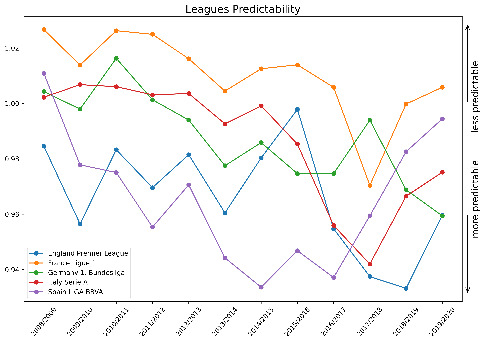
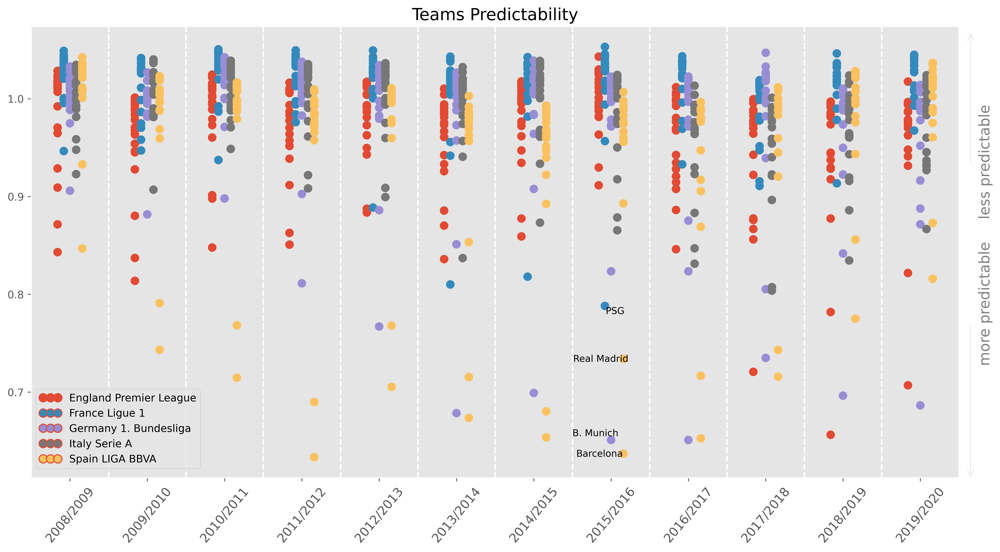

# The Most Predictable League

This work tries to answer the next question: *How predictable football really is?*

I found this post: <https://labtwentyone.tumblr.com/post/147894684062/why-did-we-stop-loving-football>
and I'm just updating the data and restructuring it as a [cookiecutter data science project](https://drivendata.github.io/cookiecutter-data-science).

## Results



Until 2016/2017, the Spanish league has been the least competitive league out of the 5 leagues examined.
This has changed lately, so now English, German, and Italian leagues seems to be less competitive than Spanish.
The French league has almost always remained as the most even competition.



## Methodology

The metric which measures effectively unpredictability as a proxy to competitiveness is [**entropy**](https://en.wikipedia.org/wiki/Entropy_(information_theory)).

"In Information Theory, Entropy is a measurement for uncertainty for an event’s outcome. In our case, the event is a football match and there are three possible outcomes: a win for the first team, a win for the other team or a draw. If the three outcomes are equally probable, the uncertainty is maximal and so is the entropy (log(3)=1.584963). As the probability of a particular outcome will get closer to one - almost no uncertainty - the match entropy will approach zero."

To get the probability for each team to win in a particular game during a specific season, [odds from B365 gambling agency](https://github.com/jartigag/football-entropy/blob/master/src/features/build_features.py#L7) has been used.

## Data

This [Kaggle's European Soccer database](https://www.kaggle.com/hugomathien/soccer), which spans across 8 years from 2008 to 2016 and includes many teams and matches statistics, has been used to examine the top 5 European leagues and determine which is the most competitive league.

To complete the data until the most recently finished season, matches from 2016/17 to 2019/20 has been downloaded from <https://www.football-data.co.uk>.

# Miscelaneous

## Virtual environment

* `make create_environment` - Create virtual environment
* `source venv/bin/activate` - Activate virtual environment
* `ipython kernel install --user --name=venv` - Install virtual environment as the kernel of Jupyter Notebooks

## Tricks from "Data Science if Software: Developer #lifehacks for the Jupyter Data Scientist"

["Data Science if Software: Developer..." - Peter Bull l ODSC East 2017](https://youtu.be/HM56wCNxCnQ)

```
pip install nbdime
# in a git repo,
git-nbdiffdriver config --enable
git diff notebooks/
```

```
# paste https://gist.github.com/pjbull/221685a8e03a01baaf1e (bit.ly/py-html-config) into:
vim ~/.jupyter/jupyter_notebook_config.py
cd notebooks
touch .ipynb_saveprogress
# so now, when a .ipynb is edited, a directory is created with plain .py and .html copies
```

## Welcome to MkDocs

For full documentation visit [mkdocs.org](https://www.mkdocs.org).

### MkDocs commands

* `mkdocs new [dir-name]` - Create a new project.
* `mkdocs serve` - Start the live-reloading docs server.
* `mkdocs build` - Build the documentation site.
* `mkdocs -h` - Print help message and exit.

### MkDocs project layout

    mkdocs.yml    # The configuration file.
    docs/
        index.md  # The documentation homepage.
        ...       # Other markdown pages, images and other files.
